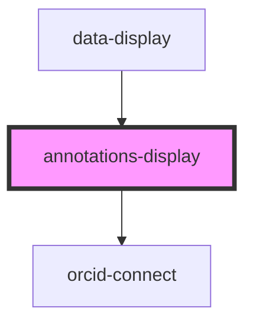

# annotations-display

<!-- Auto Generated Below -->

## Properties

| Property          | Attribute           | Description | Type      | Default     |
| ----------------- | ------------------- | ----------- | --------- | ----------- |
| `additionalType`  | `additional-type`   |             | `string`  | `undefined` |
| `annotations`     | `annotations`       |             | `any`     | `[]`        |
| `authenticated`   | `authenticated`     |             | `boolean` | `false`     |
| `identifier`      | `identifier`        |             | `string`  | `undefined` |
| `link`            | `link`              |             | `any`     | `undefined` |
| `orcidClientId`   | `orcid-client-id`   |             | `string`  | `undefined` |
| `orcidName`       | `orcid-name`        |             | `string`  | `undefined` |
| `readOnlyMode`    | `read-only-mode`    |             | `boolean` | `true`      |
| `throughputToken` | `throughput-token`  |             | `string`  | `null`      |
| `useOrcidSandbox` | `use-orcid-sandbox` |             | `boolean` | `undefined` |

## Dependencies

### Used by

 - [data-display](../data-display)

### Depends on

- [orcid-connect](../orcid-connect)

### Graph

----------------------------------------------

*Built with [StencilJS](https://stenciljs.com/)*
