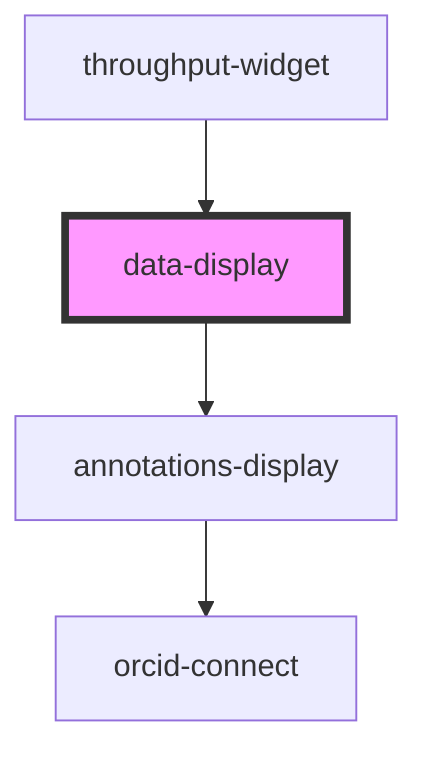

# data-display

<!-- Auto Generated Below -->

## Properties

| Property          | Attribute          | Description | Type      | Default     |
| ----------------- | ------------------ | ----------- | --------- | ----------- |
| `additionalType`  | `additional-type`  |             | `string`  | `undefined` |
| `annotations`     | `annotations`      |             | `any`     | `[]`        |
| `authenticated`   | `authenticated`    |             | `boolean` | `false`     |
| `identifier`      | `identifier`       |             | `string`  | `undefined` |
| `link`            | `link`             |             | `any`     | `undefined` |
| `orcidClientId`   | `orcid-client-id`  |             | `string`  | `undefined` |
| `orcidName`       | `orcid-name`       |             | `string`  | `undefined` |
| `readOnlyMode`    | `read-only-mode`   |             | `boolean` | `undefined` |
| `throughputToken` | `throughput-token` |             | `string`  | `null`      |

## Dependencies

### Used by

 - [throughput-widget](../throughput-widget)

### Depends on

- [annotations-display](../annotations-display)

### Graph

----------------------------------------------

*Built with [StencilJS](https://stenciljs.com/)*
