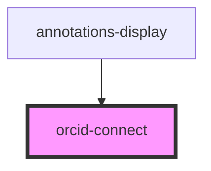

# orcid-connect

<!-- Auto Generated Below -->

## Properties

| Property        | Attribute         | Description | Type      | Default     |
| --------------- | ----------------- | ----------- | --------- | ----------- |
| `authenticated` | `authenticated`   |             | `boolean` | `undefined` |
| `orcidClientId` | `orcid-client-id` |             | `string`  | `undefined` |
| `orcidName`     | `orcid-name`      |             | `string`  | `undefined` |

## Events

| Event         | Description | Type                |
| ------------- | ----------- | ------------------- |
| `orcidLogout` |             | `CustomEvent<void>` |

## Dependencies

### Used by

 - [annotations-display](../annotations-display)

### Graph

----------------------------------------------

*Built with [StencilJS](https://stenciljs.com/)*
