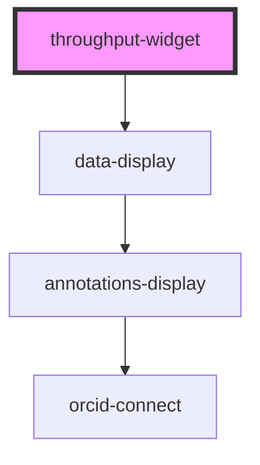

# throughput-widget

<!-- Auto Generated Below -->

## Properties

| Property          | Attribute           | Description | Type      | Default |
| ----------------- | ------------------- | ----------- | --------- | ------- |
| `additionalType`  | `additional-type`   |             | `string`  | `null`  |
| `identifier`      | `identifier`        |             | `string`  | `null`  |
| `link`            | `link`              |             | `any`     | `null`  |
| `orcidClientId`   | `orcid-client-id`   |             | `string`  | `null`  |
| `readOnlyMode`    | `read-only-mode`    |             | `boolean` | `false` |
| `useOrcidSandbox` | `use-orcid-sandbox` |             | `boolean` | `false` |

## Dependencies

### Depends on

- [data-display](../data-display)

### Graph

----------------------------------------------

*Built with [StencilJS](https://stenciljs.com/)*
